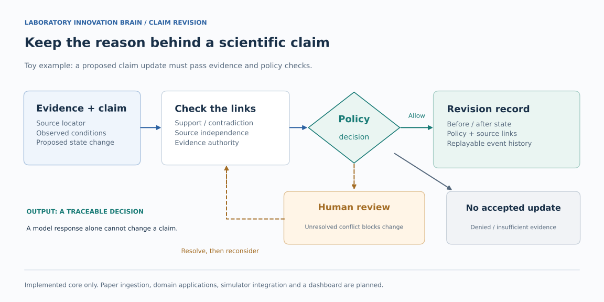

# Laboratory Innovation Brain

Keep scientific evidence connected to the claims it supports or challenges.

Connect a source to the claim it supports or challenges, then check whether
that evidence permits a change. An accepted revision records the previous and
new state, evidence links, time and the rule used. The history can be replayed
to trace how the claim reached its current state.

**Core evidence and revision logic is implemented; lab applications are planned.**
Paper ingestion, the Silicon Photonics
DomainPack, Lumerical integration and a dashboard are not available yet.
See [implementation status](IMPLEMENTATION_STATUS.md) for the current limits.

[Inspect a small fixture](tests/contract/test_belief_transition.py) · [Run core checks](#quick-start-core-checks) · [Read the specification](docs/spec/SAI_3.3.md)



The figure compares three **toy policy cases**, not scientific findings. A
request to change a claim from `ACTIVE` to `SUPPORTED` can be allowed, held for
more evidence, or sent for human review. Only an allowed decision can create
a recorded revision. A review request does not itself change the claim.

A small fixture changes `ACTIVE` to `SUPPORTED` and records relation `rel:1`
under policy version `1.0.0`. These are test identifiers, not measured findings.
[Inspect the recorded revision](tests/contract/test_belief_transition.py) and
[replay checks](tests/contract/test_belief_replay.py) show how the history stays
connected to its evidence.

## Quick Start: core checks

Use Python 3.12+. These tests exercise toy evidence and revision policies,
including refused transitions. They need no database, model API or simulator.

```powershell
git clone https://github.com/SpadesZ/laboratory-innovation-brain.git
cd laboratory-innovation-brain
python -m venv .venv
.\.venv\Scripts\python -m pip install -e ".[dev,postgres]"
.\.venv\Scripts\python -m pytest `
  tests/contract/test_belief_transition.py `
  tests/contract/test_transition_policy.py `
  tests/contract/test_belief_replay.py `
  tests/contract/test_belief_revision_event.py -q
```

Installing dependencies needs network access. Running these core checks after
installation does not. A pass verifies this fixture path, not a complete lab
application or a scientific finding.

---

## 技術細節與原始設計說明（繁體中文）

M0a 已有 maintainer sign-off；M0b 仍為當前里程碑。已實作的核心證據與修訂邏輯，
不代表 lab applications 或整個後續研究流程已完成。

實驗室的科研信念狀態，作為可追溯、可反駁、可繼承的結構化記憶。

- **規格**：[SAI 3.3](docs/spec/SAI_3.3.md)（`SAI` 是規格文件名稱，不是產品名稱）
- **目標系統**：Laboratory Innovation Brain
- **第一個 DomainPack**：Silicon Photonics（**不是** core hard-code）

它不是論文問答機器人，不是 simulation 跑批工具，也不是 LLM agent swarm。它要做三件事：

1. **記得為什麼** — 不只存結論，存證據鏈與當時的條件
2. **知道自己不知道** — `UNKNOWN` 是合法狀態，不得由模型補值
3. **知道下一步最便宜的驗證是什麼** — 不預設一定要跑模擬

## 核心不變式

任何繞過這條路徑直接修改信念狀態的實作，都會被靜態測試拒絕（SYS-001）：

```
Artifact / SourceWork
  → Claim / Observation
  → Attestation
  → RelationJudgment
  → TransitionPolicy
  → BeliefRevisionEvent
  → EpistemicStateProjection
```

## 快速開始

```powershell
python -m venv .venv
.\.venv\Scripts\python.exe -m pip install -e ".[dev,postgres]"
.\.venv\Scripts\python.exe -m pytest
```

安裝完成後，核心測試不需要 PostgreSQL、Lumerical license 或外網（AGT-007）。需要真實後端的測試以
`postgres` / `lumerical` / `network` marker 標記並預設跳過。

```powershell
# 需要真實 PostgreSQL 的測試
docker compose up -d
$env:LAB_BRAIN_TEST_POSTGRES = "1"
.\.venv\Scripts\python.exe -m pytest -m postgres
```

## 專案結構

| 路徑 | 內容 |
|---|---|
| `src/lab_brain/core/` | domain-agnostic 核心：models / epistemic / provenance / repositories / policies |
| `src/lab_brain/domains/` | 規劃中的 DomainPack 路徑；目前尚未建立。Silicon Photonics 與 Lumerical 整合屬後續里程碑 |
| `src/lab_brain/spec/` | 規格的機器可讀投影，供 T-SPEC-001 / T-SPEC-002 使用 |
| `migrations/` | 版本化 SQL migration，schema 語意的唯一落地處 |
| `docs/normative_statements.yaml` | Normative Statement Registry（§23.6） |
| `docs/milestones.yaml` | 里程碑閘門與 requirement 分配（§26.1） |
| `docs/spec_coverage_audit/` | 每個里程碑出口前的人工稽核記錄（§23.5 (2)） |
| `docs/adr/` | Architecture Decision Records |
| `IMPLEMENTATION_STATUS.md` | 當前實作狀態，Requirement / Test 逐條對照 |

`core/` 不得 import `domains/silicon_photonics`（§24.2，由 T-EXT-001 強制）。

## 規格治理

59 requirements ↔ 59 tests（`v3.3-a6` 新增 EVI-009 後由 58 改為 59；權威數字由
`scripts/update_status.py` 自規格推導寫入 `IMPLEMENTATION_STATUS.md`，此處僅為轉述）。
兩條 spec 測試守住這個不變式：

| Test | 檢查 |
|---|---|
| `T-SPEC-001` | Requirement ID 唯一；每條 requirement 至少一個 test；沒有 test 指向未知 ID |
| `T-SPEC-002` | Registry 內部一致；每筆 entry 對應既有 Test ID 或帶明確 DEFERRED rationale |

**Registry 的完整性不由 CI 保證。** §23.5 把覆蓋責任拆成兩段：T-SPEC-002 只驗證登錄項彼此一致，
「正文每一條 hard MUST 都已登錄」是人工稽核閘門，產出 `docs/spec_coverage_audit/<milestone>.md`。
T-SPEC-002 通過**不得**被推論為 registry 完整。

遇到規格內部衝突時，依 AGT-015：**block 當前 slice、建立 spec issue**，不得選「看起來比較新」的那段繼續施工。

## 貢獻規則：commit 不得標註 AI 作者

這是**儲存庫貢獻規則**，不是 SAI Requirement——它不新增 Requirement/Test ID，59 ↔ 59 不受影響。

commit message **不得**出現把此次 commit 的作者身分歸給 AI 的 trailer 或署名行
（AI 身分的 `Co-Authored-By:`、`Generated-by:`、`AI-generated:`、`Assisted-by:` 等，
以及 `Generated with <模型>` 這類 footer）。

規則刻意窄：

- **人類的 `Co-Authored-By:` 不受影響**，包含 GitHub 的 `@users.noreply.github.com` 私密信箱；
- **在內文討論 AI 完全可以**——提到 provider adapter、benchmark 用了哪個模型、甚至討論這條規則本身，
  都不會被擋。被擋的只有「署名」。

```powershell
.\scripts\dev.ps1 hooks            # 安裝 commit-msg hook（core.hooksPath -> .githooks）
.\scripts\dev.ps1 commit-hygiene   # 手動檢查目前 enforced 範圍
```

**hook 只是即時回饋,CI 才是閘門。** `core.hooksPath` 需手動開啟、`--no-verify` 可略過、
新 clone 預設沒有、網頁介面 commit 根本不會跑 hook——所以 `.github/workflows/ci.yml` 的
`commit-hygiene` job 才是權威,它重跑 `ENFORCED_FROM..HEAD` 全範圍。

**向前適用。** `ENFORCED_FROM` 是規則建立前的最後一個 commit;既有歷史已逐筆驗證乾淨,
**不為了套用事後規則而改寫已發佈的歷史**。
